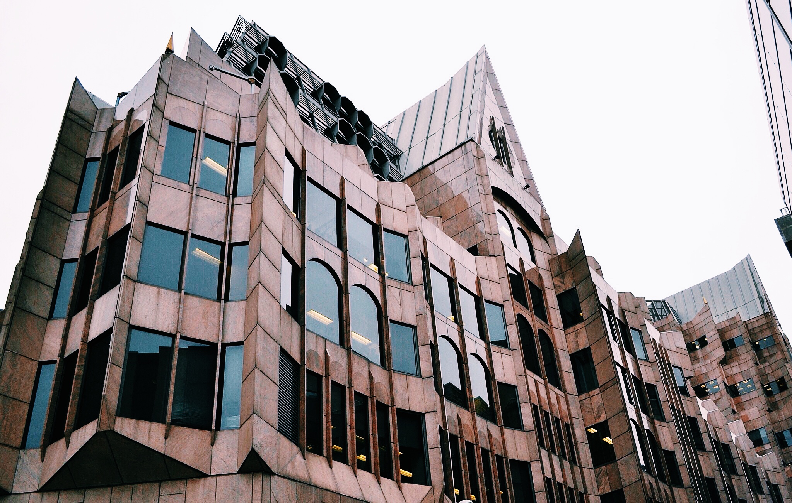

#  完美的全屏幕背景图(Perfect Full Page Background Image)

> 最近对CSS颇感兴趣，所以拿一些教程练手，觉得这篇教程挺不错的，翻译一下，也顺便练练手;
> 这篇教程还在更新之中，如果有新的内容我也会顺便维护一下更新；
 
> [教程原文地址](https://css-tricks.com/perfect-full-page-background-image/)
> [翻译教程地址](https://github.com/JobsLong/css-tricks/full-page-background-image)

我们的目标是让一张背景图能够覆盖整个浏览器窗口，在做之前，先提一下对最后效果的要求：

* 图片要填充整个窗口，没有边距；
* 根据需要缩放图片
* Retains image proportions (aspect ratio)[保持图像的比例（纵横比）]
* 图片居中于页面
* 不要造成任何scrollbar
* 尽可能多的浏览器兼容
* Isn't some fancy shenanigans like Flash

如果你也有兴趣开始学习这个tricks，那就赶快开始吧，不要拖着哦；

这里有些站点，可以挑一些自己喜欢的背景图来完成这个教程：

https://github.com/heyalexej/awesome-images


## 简单快速的纯CSS3方式

使用 `CSS3` 中的 `background-size` 属性，我们可以以纯CSS的方式来实现这个效果。我们将使用HTML元素（而不是 `body`，因为它的高度经常会比浏览器窗口的高度低）。我们在其上设置一个固定居中的背景，然后设置 `background-size` 属性为cover来调整它的大小。

`CSS` 代码：

```
html { 
    background: url(images/bg.jpg) no-repeat center center fixed; 
    -webkit-background-size: cover;
    -moz-background-size: cover;
    -o-background-size: cover;
    background-size: cover;
}
```

`HTML` 代码：

```
<!DOCTYPE html>
<html>

<head>
    <meta charset="UTF-8">
    
    <title>Full Page Background Image | Progressive</title>
    
    <style>
        * { margin: 0; padding: 0; }

        html {
            background: url(image/bg.jpg) no-repeat center center fixed;
            -webkit-background-size: cover;
            -moz-background-size: cover;
            -o-background-size: cover;
            background-size: cover;
        }   

        #page-wrap { 
            width: 400px;
            margin: 50px auto;
            padding: 20px;
            background: white;
            opacity: 0.8;
            -moz-box-shadow: 0 0 20px black; 
            -webkit-box-shadow: 0 0 20px black; 
            box-shadow: 0 0 20px black;
        }
        p { font: 15px/2 Georgia, Serif; margin: 0 0 30px 0; text-indent: 40px; }
    </style>
</head>

<body>

    <div id="page-wrap">
        <h1>Architecture</h1>
        ...   
    </div>
    
</body>

</html>

```

效果图：


没有去做浏览器兼容的测试，直接贴一下原教程的测试结果：

* Safari 3+
* Chrome Whatever+
* IE 9+
* Opera 10+ (Opera 9.5 supported background-size but not the keywords)
* Firefox 3.6+ (Firefox 4 supports non-vendor prefixed version)

`更新内容:`

对于让IE如何更好的实现这个效果有下面的一些讨论：

*Goltzman* writes：

可以通过添加以下代码：

```
{
    filter: progid:DXImageTransform.Microsoft.AlphaImageLoader(src='.myBackground.jpg', sizingMethod='scale');
    -ms-filter: "progid:DXImageTransform.Microsoft.AlphaImageLoader(src='myBackground.jpg', sizingMethod='scale')";
}
```

但是需要注意的是，这有可能会让页面上的链接失效；

*Matt Litherland* writes:

任何人试图使用上述IE过滤器和有问题的滚动条或死链接或任何其他（如以上）问题，应尽量不在HTML或body元素上使用他们，而是用 `100％的宽度和高度的固定位置的div`。

### CSS-Only Technique #1


非常感谢 [Doug Neiger](http://dougneiner.com/) 提供的实现版本。在这块内容中我们使用单行的 `` 元素，他可以在任何浏览器内调整尺寸。为了让它垂直填充满整个浏览器窗口，我们需要设置一下 `min-height` 属性, 设置 `width:100%`让它填充水平方向。我们还需要设置一下 `min-width`, 这样图片就永远不会小于它实际的尺寸了。


需要特别说明的是，这种实现需要使用 `media` 查询去检测浏览器窗口是否比图片小，然后使用precentage-left和left margin组合来使图片始终保持居中；

先看一下 `CSS` 代码：

```
img.bg {
  /* Set rules to fill background */
  min-height: 100%;
  min-width: 1024px;
	
  /* Set up proportionate scaling */
  width: 100%;
  height: auto;
	
  /* Set up positioning */
  position: fixed;
  top: 0;
  left: 0;
}

@media screen and (max-width: 1024px) { /* Specific to this particular image */
  img.bg {
    left: 50%;
    margin-left: -512px;   /* 50% */
  }
}

```

浏览器兼容：

* Any version of good browsers: Safari / Chrome / Opera / Firefox
* IE 6: Borked - but probably fixable if you use some kind of fixed positioning shim
* IE 7/8: Mostly works, doesn't center at small sizes but fills screen fine
* IE 9: Works

`HTML` 文件在地址[这里](https://github.com/JobsLong/css-tricks/blob/master/full-page-background-image/css-1.html)

### CSS-Only Technique #2

另外一种更简单的方式是，让背景图片位置固定在左上角，然后设置一下 `min-width` 和 `min-height` 为 `100%` 来保持一图片的比例大小，看代码：

`CSS` 代码：

```
img.bg {
	position: fixed;
	top: 0;
	left: 0;

	/* Preserve aspet ratio */
	min-width: 100%;
	min-height: 100%;
}
```

但是这种实现方案并不能满足我们的需求，我们需要图片居中显示。我们可以通过把图片丢到一个 `div` 里面来解决这个问题。修改一下之前的 `HTML` 文件。

`HTML` 代码:

```
<div id="bg">
  
</div>
```

展示一点小tricks：

`CSS` 代码：

```
  #bg {
    position: fixed;
    top: -50%;
    left: -50%;
    width: 200%;
    height: 200%;
  }

  #bg img {
    position: absolute; 
    top: 0; 
    left: 0; 
    right: 0; 
    bottom: 0; 
    margin: auto; 
    min-width: 50%;
    min-height: 50%;
  }
```

感谢[Corey Worrell](http://coreyworrell.com/)提供这种实现方案;

浏览器兼容：

* Safari / Chrome / Firefox (didn't test very far back, but recent versions are fine)
IE 8+
* Opera (any version) and IE both fail in the same way (wrongly positioned, not sure why)
* Peter VanWylen wrote in to say that if you add the image via JavaScript, the img needs to have width: auto; and height: auto; to work in IE 8, 9, or 10.

HTML 文件在[这里](https://github.com/JobsLong/css-tricks/blob/master/full-page-background-image/css-2.html)

### jQuery Method

如果我们知道图片以及浏览器窗口的高宽比例，那么实现这个效果会变得非常容易（从CSS的角度来看）。如果图片的宽高比小于浏览器的，那么就只需要将图片的 `width` 设置为 `100%`，然后图片就会填充满整个窗口，反之，则需要将 `height` 设置为 `100%`;

我们完全可以通过 `Javascript` 来实现这个想法；我更喜欢用 `jQuery` 来实现；

`HTML` 代码：

```

```

`CSS` 代码:

```
#bg { position: fixed; top: 0; left: 0; }
.bgwidth { width: 100%; }
.bgheight { height: 100%; }
```

`Javascript` 代码：

```
$(window).load(function() {
	var theWindow = $(window);
	var $bg = $('#bg');
	var aspectRatio = $bg.width() / $bg.height();

	function resizeBg() {
		if(theWindow.width() / theWindow.height() < aspectRatio) {
			$bg
				.removeClass()
				.addClass('bgheight');
		} else {
			$bg
				.removeClass()
				.addClass('bgwidth');
		}
	}

	theWindow.resize(resizeBg).trigger('resize');
});
```

浏览器兼容性：

* IE7+ (could probably get in IE6 with a fixed position shim)
* Most any other desktop browser

`更新部分（2012年7月）：` Reader Craig Manley says: 可以根据屏幕尺寸去加载合适的背景图片。就是说，不要尝试为iPhone加载一个1900px尺寸的图片。

首先你需要制作类似 1024.jpg,1280.jpg,160,jpg等一系列的资源文件，然后去加载一个 `shim` 而不是 `img`;

`HTML` 代码：

```

```

如果你不喜欢 gif shim（原教程作者说还ok啦，毕竟这个元素不是`content`, 而仅仅是一个背景而已），你也可以去加载一个真实的图片来替代它，这段代码就是为了实现这个方案。

下面这段代码，就是根据屏幕宽度去加载不同src属性值。如果你觉得这段代码有用，可以浏览一下：

`jQuery` 代码：

```
(function() {

var win = $(window);

win.resize(function() {
    
    var win_w = win.width(),
        win_h = win.height(),
        $bg    = $("#bg");

    // Load narrowest background image based on 
    // viewport width, but never load anything narrower 
    // that what's already loaded if anything.
    var available = [
      1024, 1280, 1366,
      1400, 1680, 1920,
      2560, 3840, 4860
    ];

    var current = $bg.attr('src').match(/([0-9]+)/) ? RegExp.$1 : null;
    
    if (!current || ((current < win_w) && (current < available[available.length - 1]))) {
      
      var chosen = available[available.length - 1];
      
      for (var i=0; i<available.length; i++) {
        if (available[i] >= win_w) {
          chosen = available[i];
          break;
        }
      }
      
      // Set the new image
      $bg.attr('src', '/img/bg/' + chosen + '.jpg');
      
      // for testing...
      // console.log('Chosen background: ' + chosen);
      
    }

    // Determine whether width or height should be 100%
    if ((win_w / win_h) < ($bg.width() / $bg.height())) {
      $bg.css({height: '100%', width: 'auto'});
    } else {
      $bg.css({width: '100%', height: 'auto'});
    }
    
  }).resize();
  
})(jQuery);
```
需要注意的是屏幕尺寸并不一定是更改背景图片很好的一个依据，可以看一下[这篇文章](https://css-tricks.com/which-responsive-images-solution-should-you-use/)

`HTML` 文件在[这里]()

*** 

小文/JobsLong, 2015/03/03